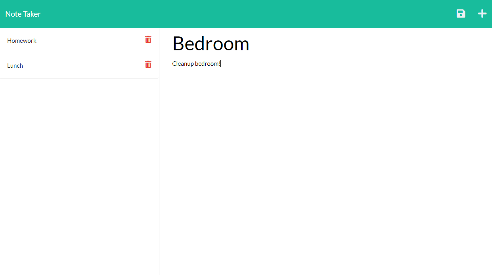

# Note Taker Starter Code

## The Motivation
This challenge really assisted me in growing my back end knowledge. Specifically, I got better at working with routes and getting info to get received from the frontend and going into the backend into my database file.

## Challenges
This challenge was interesting because there was starter code and I had to understand it before I could implement the backend with my own code. One task was actually getting the notes to save within the front end when it was only loading in my database file. Seeing the conclusion to fix this was pretty eye opening and furthered my understanding of routes. Another issue was modularizing the code enough for readability without breaking anything and I had that happen a few times.

## Screenshot

## Link
https://itzguled.github.io/weather-dashboard/